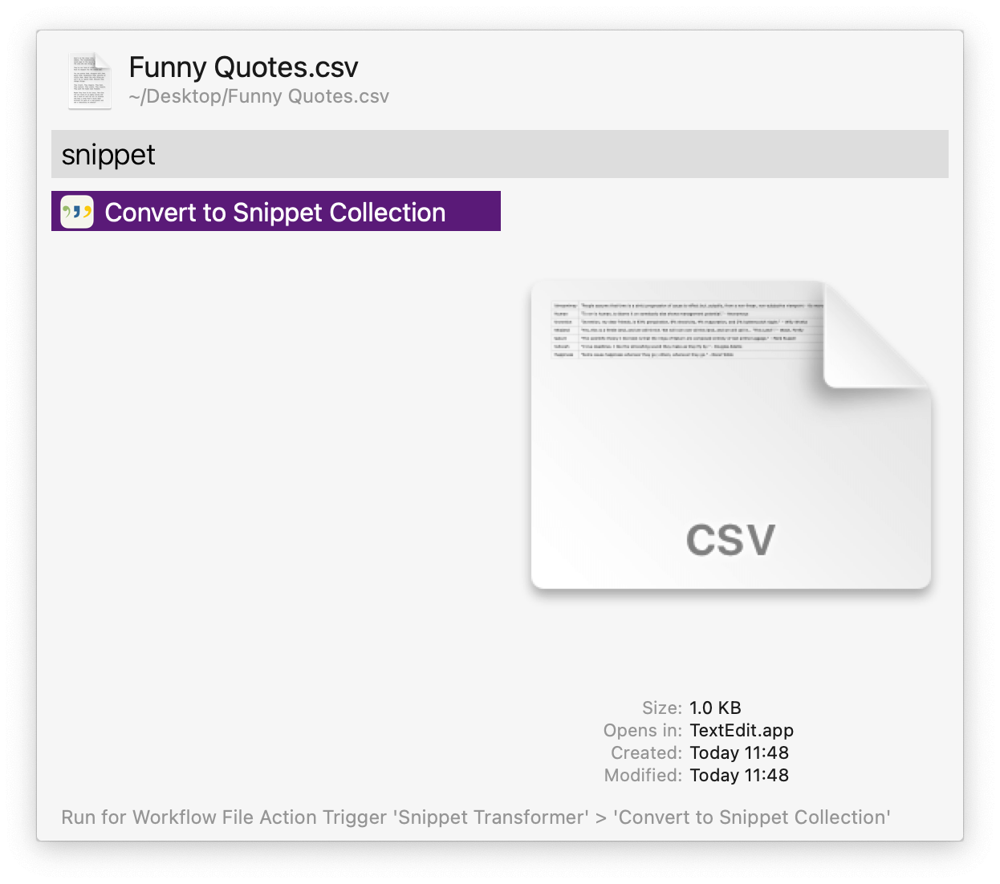
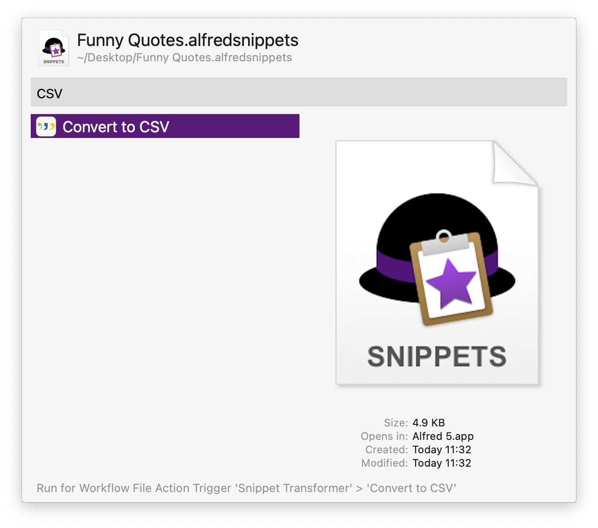

#  Snippet Transformer Alfred Workflow

Import and Export Alfred Snippet Collections

[⤓ Install on the Alfred Gallery](https://alfred.app/workflows/alfredapp/snippet-transformer)

## Usage

Convert CSV files to Alfred Snippet Collections via the [Universal Action](https://www.alfredapp.com/help/features/universal-actions/). The Snippet Collection will be saved to the Desktop and opened for import into Alfred if the option in set in the [Workflow’s Configuration](https://www.alfredapp.com/help/workflows/user-configuration/).

Converting from a Snippet Collection to CSV is also available.

Alternatively, search for CSV or Snippet Collection files via the `csvsnip` and `snipcsv` keywords.

Import [macOS Text Replacements](https://support.apple.com/en-gb/guide/mac-help/mh35735/mac) as a new Alfred Snippet Collection via the `trimport` keyword.

